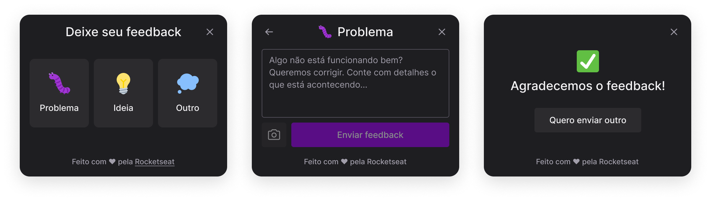

# NLW Return  - Impulse

# Front-end

Projeto que será criado.



# Vite

O **Vite** ajuda a criar um padrão de projeto para que todos os browser consiga ler, substituindo o babel.

para iniciar um projeto usando o **Vite**.

```bash
npm create vite@latest
```

**npm =** é o gerenciador de pacotes padrão do node (vem instalado junto com o node).

**create** = é o argumento para criar.

**vite@latest** = diz para o comando, criar usando o vite na sua ultima versão.

# HeadlessUi

Bibliotecas que fornece varios componentes prontos com acessibilidade inclusa.

[Documentação](https://headlessui.dev/react/menu#installation) da Biblioteca com todo passo a passo de instalação e tutorial dos componentes disponivel.

## Instalação

```bash
# npm
npm install @headlessui/react

# Yarn
yarn add @headlessui/react
```

no caso dessa aplicação ta sendo usado o popover para criar essa sobreposição.

> 💡 Os popovers são perfeitos para painéis flutuantes com conteúdo arbitrário, como menus de navegação, menus móveis e menus suspensos.

Ex:

[https://headlessui.dev/examples/react-popover-hero##](https://headlessui.dev/examples/react-popover-hero##)

# Tailwindcss

Usando **tailwindcss** para estilização dos componentes através de classes, com ele vem varios estilos prontos, como responsividade, animações simples, padronização de estilos.

usar a extensão **Tailwind CSS IntelliSense** no VsCode pode ajudar.

## Instalação

Usa a [docs](https://tailwindcss.com/docs/installation/using-postcss) para se orientar caso necessario.

```bash
npm install -D tailwindcss postcss autoprefixer
```

```bash
npx tailwindcss init -p
```

ira gerar dois arquivos dentro do seu projeto `postcss.config.js`  e `tailwind.config.js` 

no `tailwind.config.js`

```jsx
module.exports = {
  content: ["./src/**/*.{html,js}"], /*padrão gerado na hora*/
  theme: {
    extend: {},
  },
  plugins: [],
}
```


> ⚠️ **IMPORTANTE!!** mude o content para `[”./src/**/*.{js,jsx,ts,tsx}”]` isso ira interagir com os arquivos. então é importante alterar, caso não seja alterado o tailwind não ira mudar os estilos.

Crie um arquivo `global.css` e adicione esse conteudo:

```css
@tailwind base;
@tailwind components;
@tailwind utilities;
```

em seguida, importe o css no arquivo `main.tsx` 

```jsx
import "./global.css" /*encontre o arquivo e importe de modo global*/
```


## Adicionando plugins ao tailwind

### Tailwind Form

Começando pelo uso de Forms  com estilização propria do tailwind.

[Github](https://github.com/tailwindlabs/tailwindcss-forms) do plugins com o guia de instalação.

Ex:

```bash
npm install -D @tailwindcss/forms
```

lembrando que adicionar o plugins no `tailwind.config.js`

```jsx
// tailwind.config.js
module.exports = {
  theme: {
    // ...
  },
  plugins: [
    require('@tailwindcss/forms'),
    // ...
  ],
}
```

### Tailwind Scrollbar

semelhante ao Form porém focado para scrollbar da pagina.

[Github](https://github.com/adoxography/tailwind-scrollbar) do plugins com o guia de instalação.

```bash
npm install --save-dev tailwind-scrollbar
```

lembrando de adicionar o plugin no `tailwind.config.js`

```jsx
plugins: [
    // ...
    require('tailwind-scrollbar'),
],
```